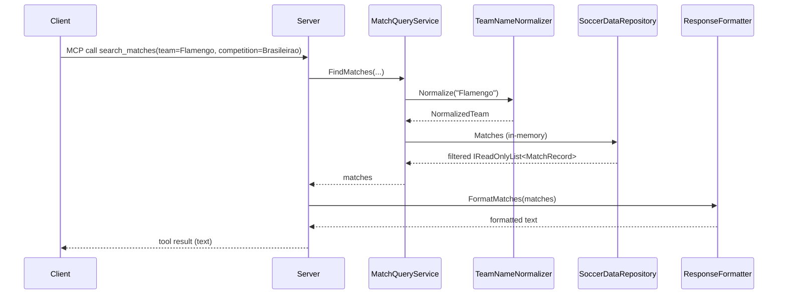

# Flow

At startup `Program.cs` calls `SoccerDataRepository.LoadFromDefaultLocation()`, which resolves `data/kaggle` via `DataPathResolver`, parses every CSV with the per-file loaders (`MatchCsvLoader`/`PlayerCsvLoader`), normalizes team names, de-duplicates the overlapping Série A datasets, and holds all matches and players in memory as a singleton. Each MCP tool call is served entirely from that in-memory store — no external API or database. A `search_matches` call normalizes the query team name, filters the match collection by the supplied criteria, and formats the result via `ResponseFormatter`. Notable characteristics: all data is loaded once at boot (fast queries, higher startup cost); rows with `NA`/blank scores (e.g. postponed matches) are skipped rather than crashing the parser; standings are computed live from match results using the 3-1-0 points system rather than being read from any table.
