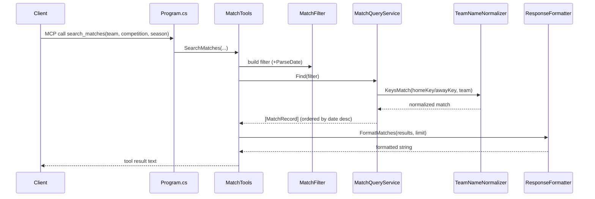

# Flow

On startup, `Program.cs` calls `DataStore.Load()`, which resolves `data/kaggle` via `DataPathResolver`, parses all five match CSVs (`MatchDataLoader`) and the FIFA player CSV (`PlayerDataLoader`) into in-memory `MatchRecord`/`PlayerRecord` lists, then registers `MatchQueryService`, `StatsQueryService`, and `PlayerQueryService` as singletons behind the MCP stdio server. A `search_matches` call flows into `MatchTools`, which builds a `MatchFilter` and delegates to `MatchQueryService.Find`. Team matching goes through `TeamNameNormalizer`, which strips state suffixes and accents so `"Flamengo"` matches `"Flamengo-RJ"` while keeping distinct clubs (Atlético-MG/-GO/-PR) separate. Results are ordered newest-first and rendered by `ResponseFormatter` into the human-readable text returned to the client. All query work is in-memory over pre-loaded lists (no database); logging is routed to stderr so it doesn't corrupt the JSON-RPC stdout stream.
