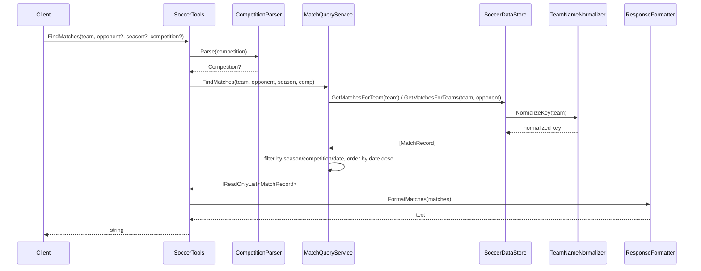

# Flow

The most representative flow is a match lookup: an MCP client invokes the `FindMatches` tool for a team.

At startup `Program.cs` calls `DataDirectoryLocator.Locate` then `SoccerDataStore.LoadFromDirectory`, which runs the five match loaders plus the FIFA player loader, deduplicates matches via `MatchDeduplicator`, and builds a team-key index; the store and five query services are registered as DI singletons. A `FindMatches` call resolves the free-text competition string through `CompetitionParser.Parse`, then delegates to `MatchQueryService`. The store normalizes team names to a canonical key (stripping state suffixes and accents) and, on an exact-key miss, falls back to a substring `Contains` match against known keys. Results are filtered by the optional season/competition/date predicates, ordered by date descending, and rendered to plain text by `ResponseFormatter`. Notable: matches with missing goals/dates are retained (with `?`/"unknown date" placeholders in output); team resolution is substring-based rather than fuzzy; empty results return the literal string "No matches found." rather than an error. The tool signature omits the `from`/`to` date-range parameters that `MatchQueryService.FindMatches` supports.
