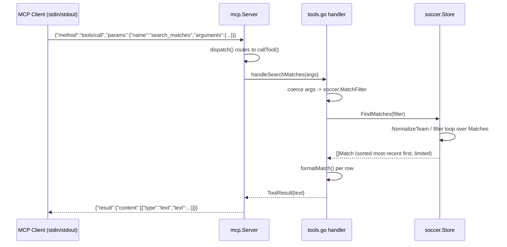

# Flow

At startup `main.go` calls `soccer.LoadDir` once to parse the six CSV files into an in-memory `Store`, which deduplicates overlapping fixtures and builds canonical team display names; the `Store` is then read-only. Each JSON-RPC line is scanned by `Server.Serve`, unmarshalled, and dispatched by method. For `tools/call`, `callTool` looks up the named handler and passes the decoded `arguments` map. A handler (here `handleSearchMatches`) coerces loosely-typed JSON args into a typed `MatchFilter`, calls the corresponding `Store` query method, and formats the value result into a single text content block returned as the JSON-RPC result.

Notable characteristics: all responses are plain formatted text (no structured JSON payload beyond the MCP wrapper); argument handling is lenient (missing/mistyped args coerce to zero values rather than erroring, e.g. `argInt` returns 0 and `argDate` returns the zero time); the store is loaded entirely into memory and queries are linear scans over the match/player slices; writes to stdout are mutex-guarded but requests are processed sequentially line by line.
