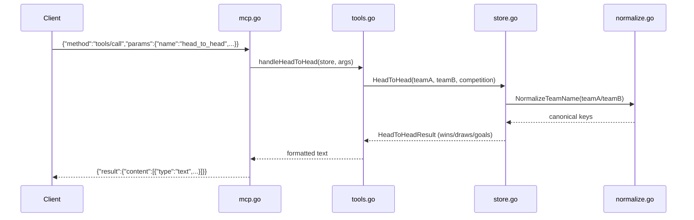

# Flow

At startup `main.go` calls `loader.go:LoadAll("data/kaggle")`, which reads all
six CSVs into `[]Match`/`[]Player`, deduplicates overlapping fixtures, and
builds team/club lookup indexes. The server then loops over newline-delimited
JSON-RPC on stdin. A `tools/call` request is routed by name through the
`ToolRegistry` to the matching handler, which unmarshals typed arguments,
delegates to a pure `Store` query method, and formats the result as MCP text
content. Team names on both the query and data sides pass through
`NormalizeTeamName` (accent stripping, state-suffix handling, alias table) so
that dataset naming variations resolve to a common key. Errors are returned as
tool results with `isError: true` rather than JSON-RPC errors, except for
malformed params/unknown tools which return JSON-RPC errors. No network access,
no external dependencies beyond the Go standard library.
