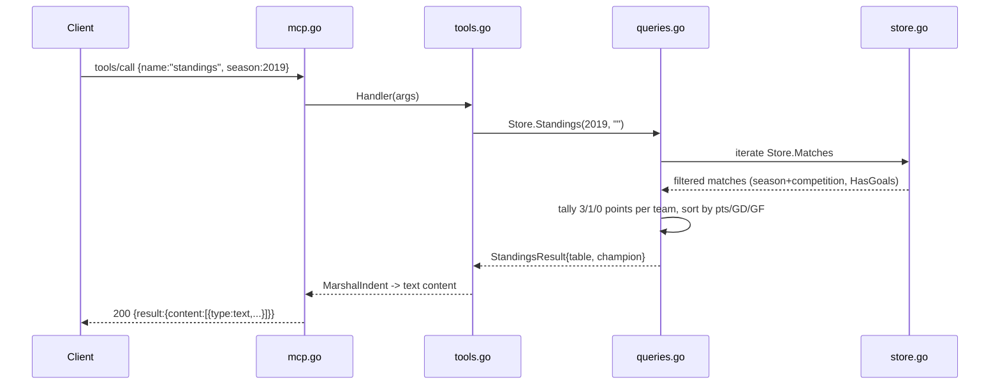

# Flow

At startup `main.go` resolves the data dir (flag → `BRAZIL_MCP_DATA_DIR` → `./data/kaggle`),
`load.go:LoadStore` parses all six CSVs into a single in-memory `Store`, normalizing team
names and deduplicating overlapping real-world matches by season cutoff. Each `tools/call`
request dispatches through `mcp.go` to a `tools.go` handler that calls the matching
`queries.go` method, which linearly scans `Store.Matches`/`Store.Players` with the request
filters and returns a typed result marshaled back as MCP text content.

Notable characteristics: stdlib-only (no MCP SDK — the JSON-RPC server is hand-rolled);
newline-delimited framing rather than Content-Length; queries are O(n) linear scans (no
indexes) — acceptable at this dataset scale. Team resolution is fuzzy: a bare name resolves
to all state variants sharing a base, while an explicit state suffix pins one club. Errors
inside a tool handler are returned as `isError:true` content rather than JSON-RPC errors.
