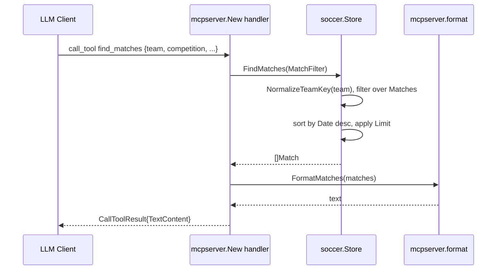

# Flow

At startup `main()` calls `soccer.LoadStoreFromDir("data/kaggle")`, which reads all six CSVs into in-memory `[]Match` and `[]Player` slices, then hands the `Store` to `mcpserver.New`, which registers seven tools and serves over stdio. The representative request — `find_matches` — builds a `MatchFilter` from the tool args (parsing `from`/`to` dates via `ParseDate`, returning an error result on bad input), then `Store.FindMatches` linearly scans every match, comparing normalized team keys (`NormalizeTeamKey` strips accents, state suffixes, and resolves aliases), sorts the survivors most-recent-first, truncates to `Limit`, and the result is rendered to plain text by `FormatMatches`.

Notable characteristics: all queries are full linear scans over the in-memory slices with no indexing; data is loaded once at startup and never refreshed. The `Brasileirao_Matches.csv` and `novo_campeonato_brasileiro.csv` sources overlap for 2012–2019 and are intentionally *not* deduplicated (the historical set is tagged `Brasileirao (Historical)`). Date parsing silently skips rows with unrecognized formats, and integer fields parse to 0 on failure (errors ignored). Team-name matching relies entirely on `NormalizeTeamKey`; only two hard-coded aliases (`atletico`, `athletico`) are handled beyond mechanical normalization.
