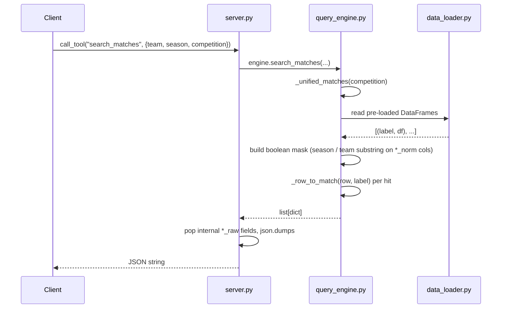

# Flow

A tool call to `search_matches` routes into `QueryEngine.search_matches`, which iterates the five match DataFrames selected by `_unified_matches` (competition filter is a substring match against the label). Filtering is done with pandas boolean masks: season compared numerically via `_to_int`, team names matched as case-insensitive substrings against the pre-normalized `home_team_norm`/`away_team_norm` columns. Matching rows are converted to a uniform dict by `_row_to_match`, the server strips internal `*_raw` keys, and returns `json.dumps(..., ensure_ascii=False)`.

Notable characteristics:
- **Data loaded once** at `create_server()` time (eager `engine.load()`), so per-call latency is pure in-memory pandas filtering — meets the spec's <2s/<5s targets.
- **Substring team matching**: `team="Atletico"` matches every Atlético across states in normalized search; standings deliberately switch to raw names to keep Atlético-MG/PR distinct.
- **No date-range filter** on the tool surface — only `season` is exposed (spec asks for "date range and/or season").
- **No pagination beyond `limit`** (simple head-truncation); no input validation on unknown competition strings (silently returns empty).
- **Aggregate stats span all five match datasets** when no competition is given; `br_football` overlaps the other Brasileirão sources, so unfiltered aggregates can double-count matches.
