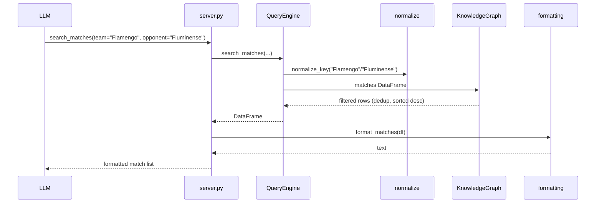

# Flow

At import time `server.py` calls `load_all()` once to read the six Kaggle
CSVs, builds a `KnowledgeGraph`, and wraps it in a `QueryEngine`. Each MCP
tool call flows: server tool → `QueryEngine` method (which normalizes names,
filters/aggregates the shared DataFrames, and drops cross-source duplicate
matches) → `formatting.py` for the human-readable string. Query methods
return plain data so they are unit-testable independently of the MCP layer;
tool wrappers add argument defaults and translate `ValueError`/
`TeamNotFoundError` into user-facing messages. No network access — all data
is local. Standings/champion calculations deliberately pick one
authoritative source per competition/season to avoid double-counting
overlapping datasets.
