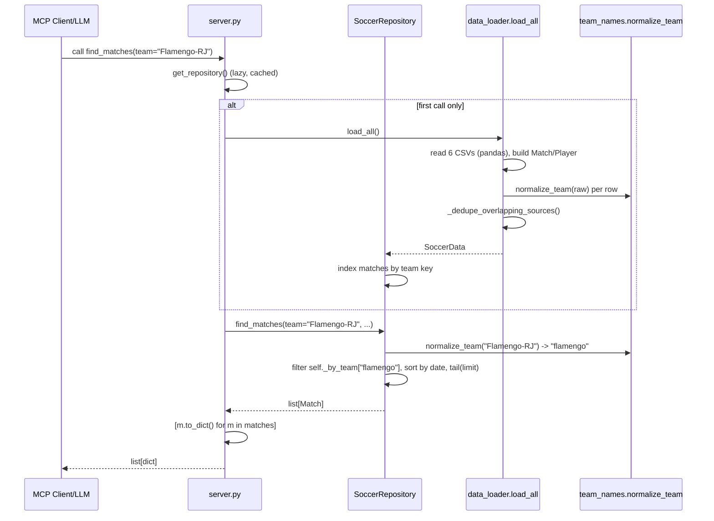

# Flow

A client calls an MCP tool such as `find_matches`. The server lazily builds a singleton `SoccerRepository` on first use: `load_all()` reads all six Kaggle CSVs with pandas, normalizes every team name to a canonical key via `normalize_team`, and deduplicates seasons covered by more than one Brasileirao/Copa do Brasil source before the repository indexes matches into a `_by_team` dict. The tool call then normalizes the query team to its key, filters the pre-indexed match list (applying opponent, competition, season, date-range, and venue predicates), sorts by date, truncates to `limit` most-recent, and returns each `Match` serialized via `to_dict()`.

Notable characteristics:
- All data is loaded fully into memory once and served synchronously; no database, no pagination cursor (just a `limit` tail).
- Team-name matching is the central design concern: an alias table plus suffix/parenthetical/accent stripping collapse variant spellings to one key.
- Overlapping source datasets are deduped per (competition, season) by a fixed priority list to avoid double-counting in aggregates like `standings` and `average_goals`.
- Input validation is minimal: dates are parsed with `date.fromisoformat` (raises on malformed input), and `best_record`'s `by` argument does a dict lookup that would `KeyError` on an unknown metric.
