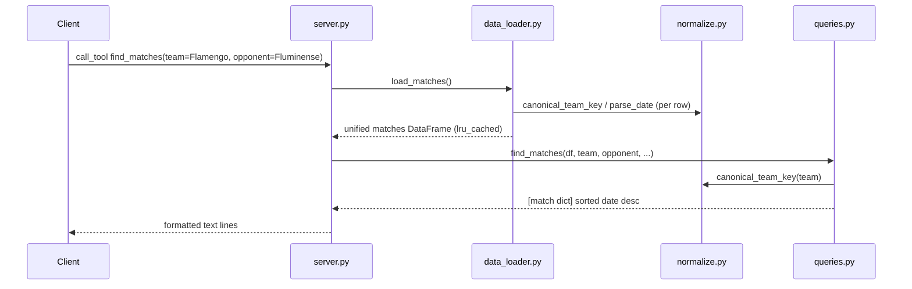

# Flow

A tool call resolves the matches frame through `data_loader.load_matches()`, which is `lru_cache`d so the 5 CSVs are parsed and unified only once per process. Team arguments are canonicalized (`normalize.canonical_team_key` — accent/punctuation/state-suffix stripping plus a full-legal-name alias table and MG/PR disambiguation for shared nicknames) before boolean masking on the DataFrame. Results are converted to dicts and rendered as human-readable text in `server.py`. Notable robustness handling: missing scores (`NaN` from postponed matches) render as `?` rather than crashing on `int(NaN)`, and `novo_campeonato_brasileiro.csv` is trimmed to pre-2012 seasons to avoid double-counting Brasileirao points in standings. No input validation on tool arguments beyond type hints; unknown team names simply yield "No matches found."
