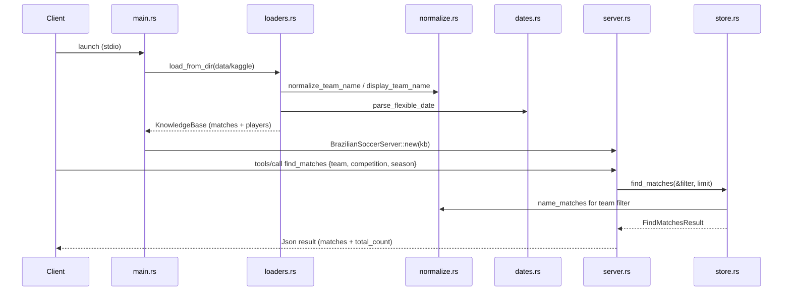

# Flow

At startup the binary loads all six CSVs once into an in-memory `KnowledgeBase`, normalizing team names and parsing mixed date formats as it goes (rows with unrecorded results — goals logged as `"NA"`/`"-"` — are skipped). The server is then served over stdio via `rmcp`. Each MCP `tools/call` is a stateless, read-only lookup against the shared `Arc<KnowledgeBase>`: e.g. `find_matches` builds a `MatchFilter`, filters via flexible team-name matching (state suffixes, accents, and full-vs-abbreviated legal names handled, while disambiguating region codes like `-MG`/`-PR` are preserved), sorts newest-first, and returns a JSON result including `total_count` before truncation by `limit`. Team-name normalization is the load-bearing cross-cutting concern shared by loaders and every match query.
