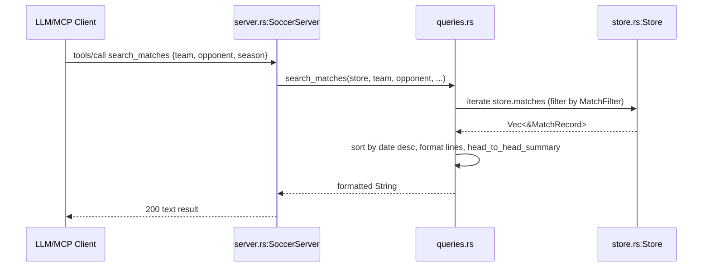

# Flow

At startup `main.rs` resolves the data directory and calls `Store::load`, which invokes the six `data.rs` CSV loaders, deduplicates the 2012–2019 Brasileirão overlap between `Brasileirao_Matches.csv` and `novo_campeonato_brasileiro.csv`, and builds display-name and ambiguous-base indices (so shared bases like "Atletico" across states are not merged in aggregate stats). The `Store` is wrapped in an `Arc` and shared read-only by all tool handlers.

A representative request — `search_matches` — flows client → `SoccerServer` tool wrapper → `queries::search_matches`, which builds a `MatchFilter`, linearly scans `store.matches`, sorts by date, and returns a pre-formatted string; when both team and opponent are given it appends a head-to-head win/draw tally.

Notable characteristics: queries are pure read-only functions over an in-memory `Vec` (linear scan, no index — acceptable at ~19k matches / ~18k players); tools return formatted prose rather than structured JSON; team matching is deliberately lenient (`contains` both directions) with explicit guards against empty-key false positives and an identity layer to disambiguate same-base clubs; malformed CSV rows are skipped rather than aborting the load.
