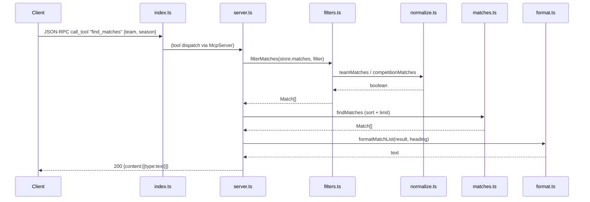

# Flow

At startup `index.ts:main()` builds a `DataStore` (default `./data/kaggle`, or `SOCCER_DATA_DIR`), calls `store.load()` to parse all six CSVs into in-memory `Match[]`/`Player[]` (diagnostics to stderr so stdio JSON-RPC stays clean), then wires `createServer(store)` to a `StdioServerTransport`.

A representative request — `find_matches` — flows: the tool handler builds a `MatchFilter` from the validated Zod inputs, `filterMatches` scans all matches applying accent/case-insensitive lenient team and competition matching plus season/date-range predicates, `findMatches` sorts chronologically and applies the limit, and `format.ts` renders the result into MCP text content. Every query module is transport-agnostic and independently testable; the same code path is exercised end-to-end in `server.test.ts` via an in-memory client/server pair.

Notable design points: input is validated by Zod schemas at the tool boundary; team names are matched leniently across datasets while standings deliberately use a *suffix-preserving* identity key so `Atlético-MG`/`Atlético-PR` stay distinct; Brasileirão appears in two overlapping source files, so standings pick a single source per season to avoid double-counting fixtures.
