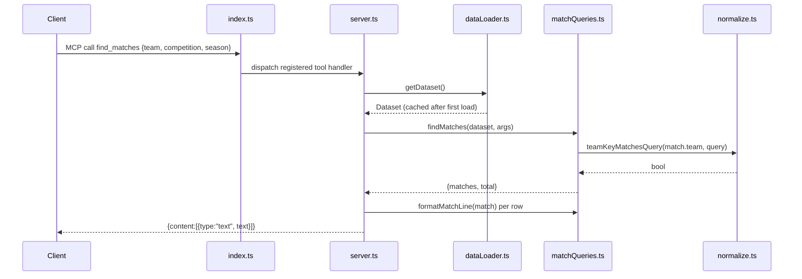

# Flow

A tool call arrives over stdio and is dispatched by the MCP SDK to the handler registered in `server.ts`. The handler calls `getDataset()`, which parses all six CSVs on first use and returns a cached in-memory `Dataset` thereafter. The query function (here `findMatches`) filters `dataset.matches` using normalized team-name/date matching from `normalize.ts`, returns the matched rows plus a total count, and the handler renders them into a plain-text MCP `content` response.

Notable characteristics (factual):
- All data is held in memory; no database. First tool call bears the full CSV parse cost; later calls are cheap.
- Team names are normalized (state-suffix stripping, accent/case folding) so `Flamengo` matches `Flamengo-RJ`.
- Cross-dataset dedup runs at load time to avoid double-counting overlapping seasons in standings/records.
- Input validation is delegated to `zod` schemas on each tool; empty result sets return a friendly "No … found" text rather than an error.
