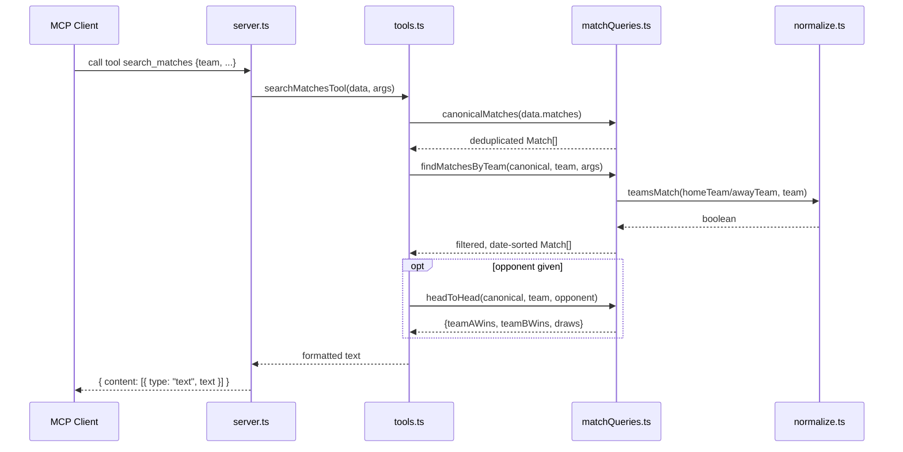

# Flow

At startup `index.ts` calls `loadAllData()`, which reads the 6 CSVs, parses each into `Match`/`Player` objects, and runs `canonicalizeTeamNames()` once to reconcile team-name variants across datasets; the in-memory `AppData` is held for the process lifetime. For a `search_matches` request, `searchMatchesTool` first calls `canonicalMatches()` to drop overlapping records (historical Brasileirão rows from 2012+ and BR-Football-Dataset rows whose competition+season is already covered by a dedicated file), then `findMatchesByTeam()` filters by team via accent- and suffix-insensitive `teamsMatch()`, applies optional opponent/competition/season/date filters, and sorts by descending date. The result is rendered to a plain-text summary; if an opponent is supplied, a head-to-head win/draw tally is appended.

Notable characteristics: all query handlers re-run `canonicalMatches()` on every call (no caching of the deduplicated set); tool outputs are plain text rather than structured JSON; competition matching is case-insensitive exact-string except where `normalizedCompetitionKey` in `matchQueries.ts` maps variants during deduplication; there is no input validation beyond the Zod schemas declared at registration, and no explicit error handling in individual tool handlers (empty results produce "No ... found" messages).
