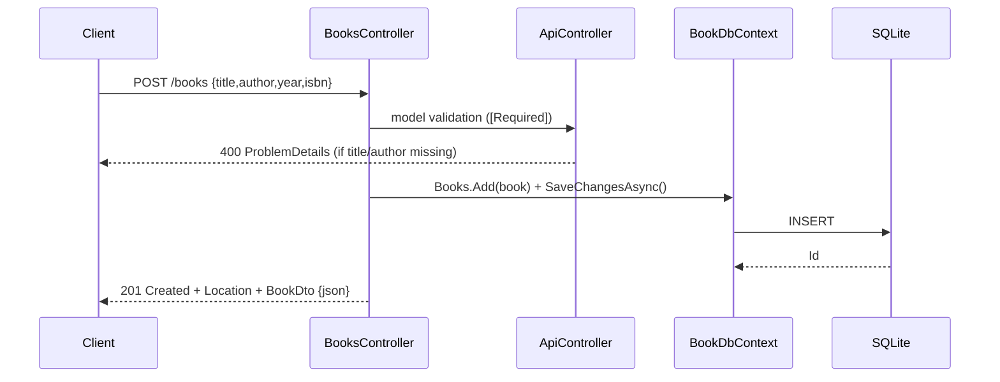

# Flow

A `POST /books` request is bound to `CreateBookRequest`. `[ApiController]` runs
`[Required]` validation first, short-circuiting to `400 ProblemDetails` when
`Title` or `Author` is null/empty. On success the controller maps the DTO to a
`Book` entity, persists it via EF Core to SQLite, and returns `201 Created` with
a `Location` header (`CreatedAtAction(nameof(GetById))`) and the `BookDto` body.
Standard REST semantics throughout; the `?author=` filter is exact-match only.
