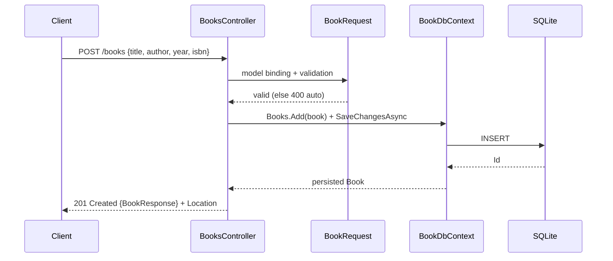

# Flow

A `POST /books` request is model-bound to `BookRequest`; `[ApiController]` runs
DataAnnotations validation and short-circuits to `400` if `Title`/`Author` are missing or
blank. On success the controller maps the DTO to a `Book` entity, persists it via EF Core to
SQLite, maps back to `BookResponse`, and returns `201 Created` with a `Location` header
pointing at `GET /books/{id}`. Persistence is real SQLite (file-backed in production via
`EnsureCreated`; a shared in-memory SQLite connection in tests). Async EF Core is used
throughout; there is no explicit exception handling around DB access (relies on framework
defaults).
