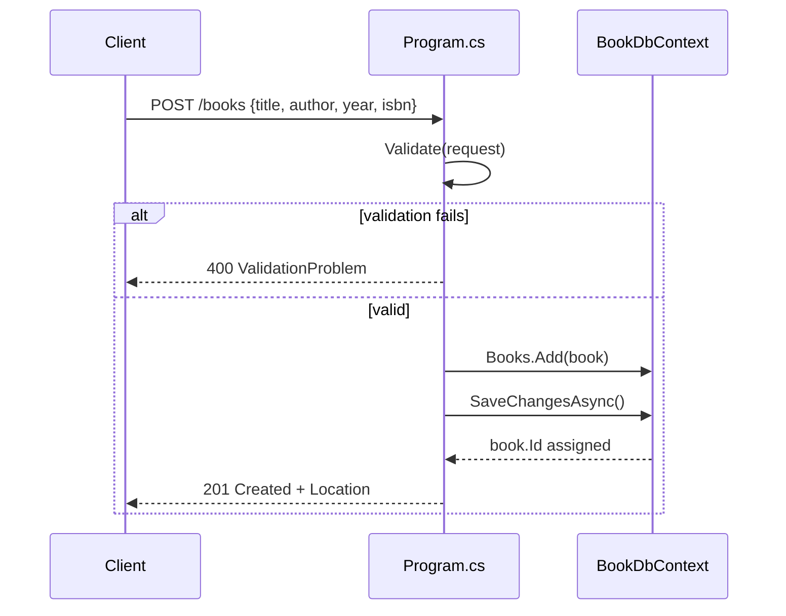

# Flow

A `POST /books` request is model-bound to `BookRequest`, validated via DataAnnotations (`Validate()` → `Validator.TryValidateObject`); on failure it returns `400` with a `ValidationProblem` error dictionary. On success the DTO is mapped to a `Book` entity, added to `BookDbContext`, and persisted to SQLite via `SaveChangesAsync()`, then returned as `201 Created` with a `Location` header pointing at `/books/{id}`. Async EF Core access throughout; validation runs before any DB access. The `?author=` filter on `GET /books` uses `Contains` (case-sensitive substring, translated to SQL LIKE).
