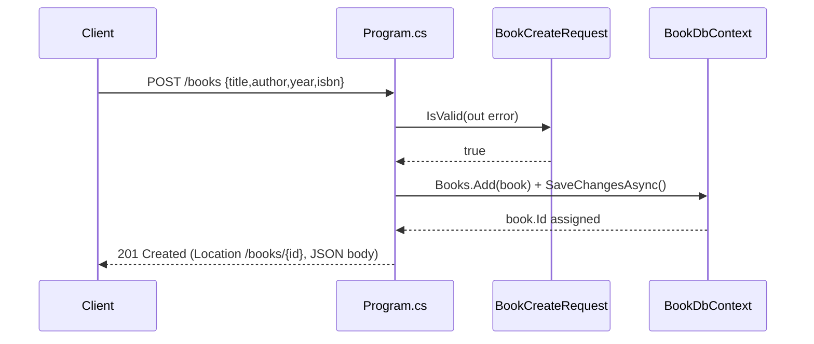

# Flow

A `POST /books` request is model-bound into a `BookCreateRequest` record, validated via `IsValid` (blank Title/Author → `400`), mapped into a `Book` entity, added to the EF Core `BookDbContext`, and persisted to SQLite via `SaveChangesAsync`. On success it returns `201 Created` with a `Location` header and the created book (including its generated `Id`) as JSON. Validation is limited to required Title/Author; `?author=` filtering on the list route is an exact string match. The DB schema is created at startup via `EnsureCreated()` (no migrations).
