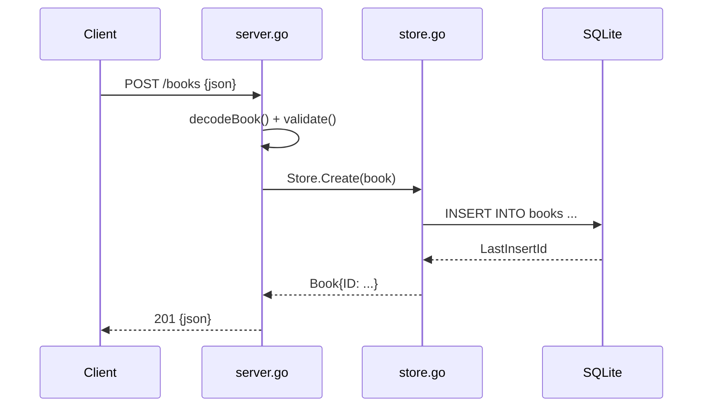

# Flow

A `POST /books` request is JSON-decoded with `DisallowUnknownFields`, then
validated (`title` and `author` must be non-blank, else `400`). On success the
handler calls `Store.Create`, which does a parameterized `INSERT` against SQLite
and returns the row's assigned auto-increment ID. The created book is written
back as `201 Created` JSON. Errors from the store surface as `500`. The store
pins the connection pool to a single connection (`SetMaxOpenConns(1)`) so a
`:memory:` DSN stays stable across queries — a deliberate accommodation for the
in-memory test database.
