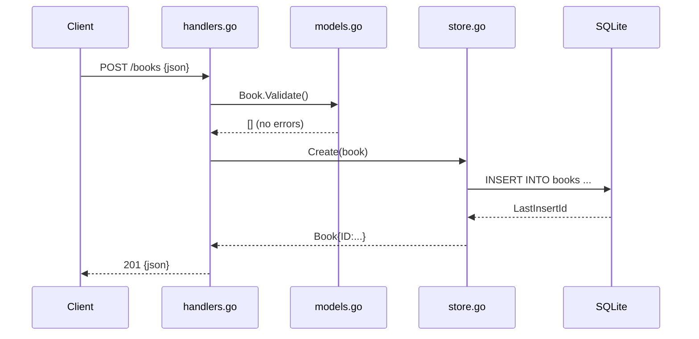

# Flow

A `POST /books` request is JSON-decoded into a `Book`; `Book.Validate()` enforces
that `title` and `author` are non-empty (returning `400` with a joined error
message otherwise). On success the handler calls `Store.Create`, which executes a
parameterized `INSERT` against SQLite and reads back the auto-assigned row ID,
then responds `201 Created` with the persisted book as JSON. All handlers follow
the same shape: parse/validate → store call → typed status. `Get`/`Update`/`Delete`
map the `ErrNotFound` sentinel to `404`, and a non-numeric `{id}` yields `400`.
Notable: author filtering is exact-match only; there is no pagination; PUT
requires the full book (no partial update); and no request-body size limit or
timeout is set.
