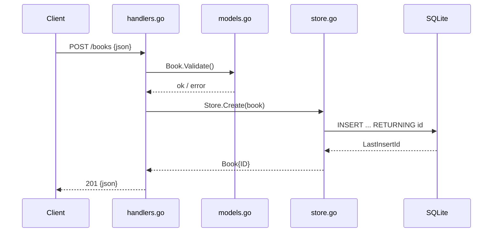

# Flow

A `POST /books` request is JSON-decoded into a `Book`, validated for required
`title`/`author` (400 on failure), then inserted via `Store.Create`, which
executes a parameterized `INSERT` and stamps the assigned auto-increment ID
onto the returned book, serialized as `201 Created`. Errors are consistently
surfaced through `writeError` as JSON `{error}` bodies. `ErrNotFound` from the
store maps to 404 on the id-scoped routes. All queries are parameterized (no
SQL injection); no pagination on the list route.
