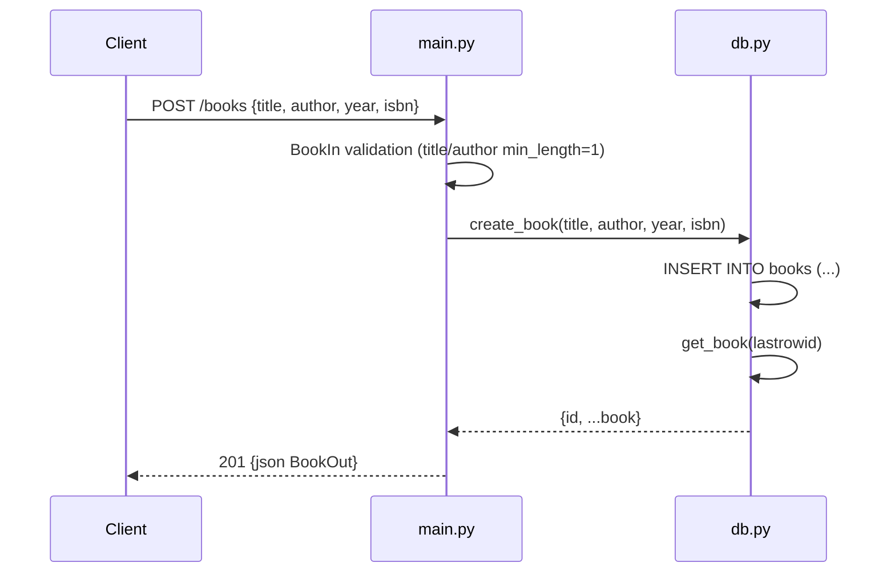

# Flow

A `POST /books` request is first validated by the `BookIn` Pydantic model,
which rejects missing or empty `title`/`author` with a 422 before any DB work.
The handler calls `Database.create_book`, which inserts the row and re-reads it
via `get_book(lastrowid)` to return the persisted record (including its
generated `id`). The row is serialized through `BookOut` and returned with a
201 status. The DB connection is created with `check_same_thread=False` so it
can be shared across uvicorn worker threads; tests inject an in-memory
`Database(":memory:")` via the `create_app(db=...)` factory.
