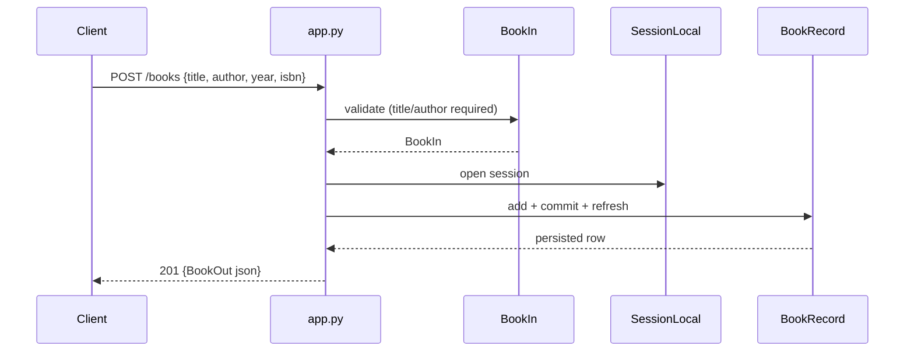

# Flow

A `POST /books` request is validated by the `BookIn` Pydantic model (rejecting
missing or whitespace-only `title`/`author` with a 422). The handler opens a new
`SessionLocal`, inserts a `BookRecord`, commits, refreshes to populate the
generated `id`, and returns the row serialized as `BookOut` with status 201.
Each handler opens and closes its own session in a `try/finally`; the module
also defines a `get_db()` dependency generator that is not wired into any route.
Persistence is synchronous SQLAlchemy against a file-backed SQLite database
(`books.db`) inside FastAPI's async app.
