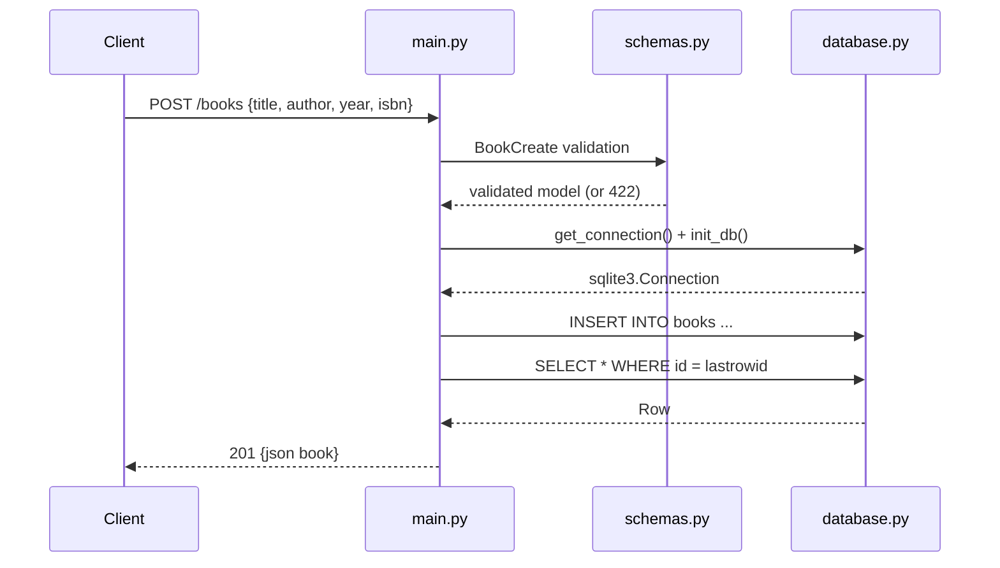

# Flow

A `POST /books` request is validated by the Pydantic `BookCreate` model (blank/missing `title` or `author` → `422`). The `get_db` dependency opens a fresh SQLite connection and calls `init_db()` (idempotent `CREATE TABLE IF NOT EXISTS`) on every request, then yields it. The handler inserts the row, commits, re-reads it by `lastrowid`, and serializes it as JSON.

Notable characteristics (factual):
- `init_db()` runs on every request via the dependency rather than once at startup.
- A new SQLite connection is opened and closed per request (no pooling).
- The `?author=` filter uses `LIKE %..% COLLATE NOCASE` (case-insensitive substring, not exact match).
- Validation failures surface as FastAPI's default `422 Unprocessable Entity` rather than `400`.
