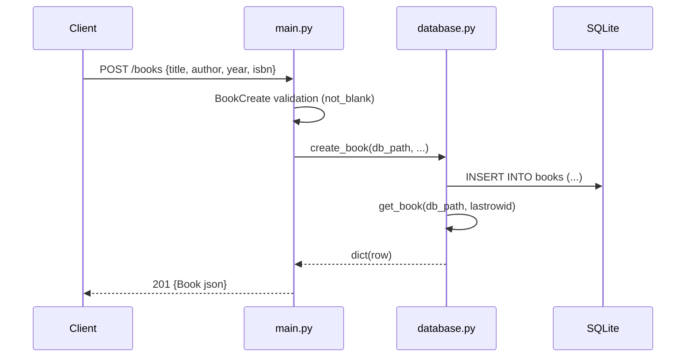

# Flow

A `POST /books` request is first validated by the `BookCreate` Pydantic model, whose `not_blank` validator strips and rejects empty `title`/`author` (returning 422 on failure). The handler resolves the DB path via a `Depends(get_db_path)` dependency (overridable in tests / via `BOOKS_DB_PATH`), calls `database.create_book`, which opens a per-request SQLite connection in a `with` block, inserts the row, and re-reads it by `lastrowid` to return the full record including the generated `id`. The response is serialized through the `Book` response model as JSON with a 201 status. Each DB call opens its own short-lived connection (no pooling); the schema is created on app startup via the `lifespan` hook calling `init_db`.
