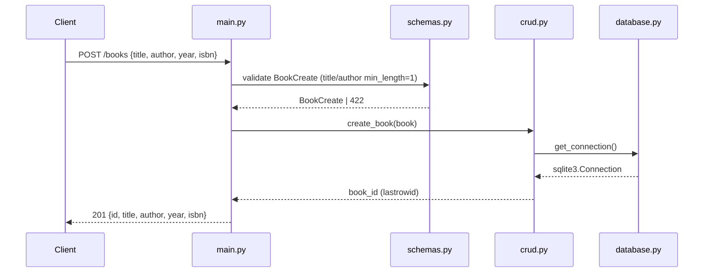

# Flow

A `POST /books` request is validated by the `BookCreate` Pydantic model (missing/empty `title` or `author` yields a 422 before any handler code runs). The handler calls `crud.create_book`, which opens a fresh SQLite connection per call, inserts the row, commits, and returns `lastrowid`. The handler echoes the created book with its new id at status 201. Each CRUD function opens and closes its own connection (no pooling); the DB path is env-var overridable (`BOOKS_DB_PATH`), which the test fixture uses for per-test isolation. Layering is clean: routing (main) → validation (schemas) → data access (crud) → connection (database).
