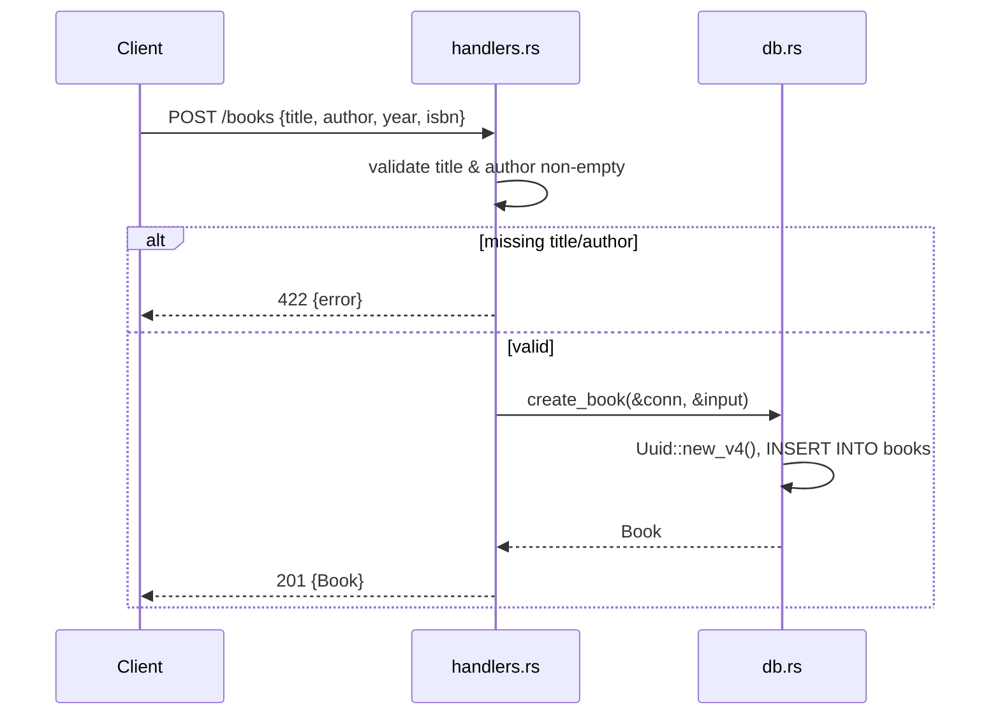

# Flow

A `POST /books` request is deserialized into `CreateBook` (all fields `Option`). The handler trims and rejects empty `title` or `author` with `422 Unprocessable Entity`. On success it locks the shared `Arc<Mutex<Connection>>`, generates a UUID v4 id, inserts a parameterized row, and returns the full `Book` as `201 Created`. Notable: validation uses `422` rather than the conventional `400`; the SQLite connection is opened in-memory (`Connection::open_in_memory`), so data is not durable across restarts; all DB access is serialized behind a single `Mutex` (synchronous rusqlite calls inside async handlers).
