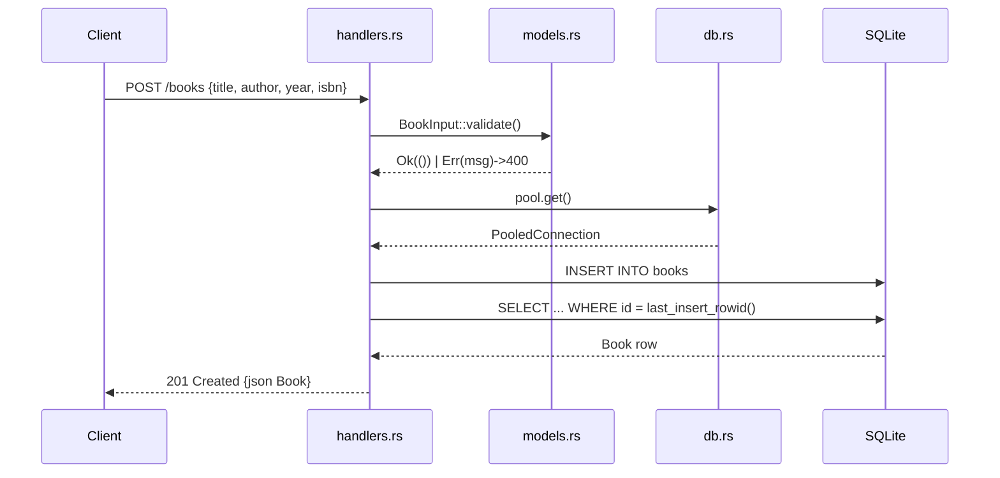

# Flow

A `POST /books` request is deserialized into `BookInput`, validated for required
`title`/`author` (empty → `AppError::Validation` → 400), then a pooled SQLite
connection inserts the row and re-selects it by `last_insert_rowid()` to return
the persisted `Book` with its generated id as JSON with status 201. Errors flow
through `AppError`'s `IntoResponse` impl: `rusqlite::Error::QueryReturnedNoRows`
maps to 404, other DB errors to 500. Data persists to SQLite (file-backed in
production, in-memory per test), not just process state.
