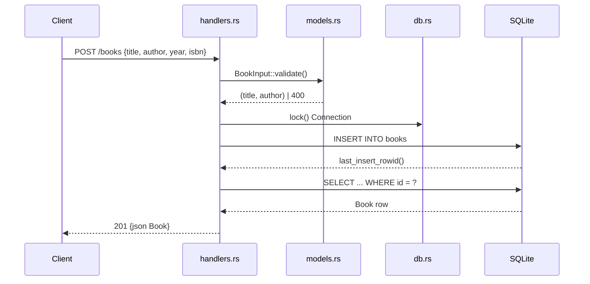

# Flow

A `POST /books` request deserializes the JSON body into `BookInput`, validates that `title` and `author` are present and non-empty (trimmed) — returning `400` with an error message otherwise — then locks the shared `Arc<Mutex<Connection>>`, inserts the row, re-selects it by `last_insert_rowid()`, and returns the persisted `Book` as `201 Created`. DB access is synchronous behind a `Mutex` inside async handlers (a single global lock serializes all requests); `rusqlite` errors map through `AppError::Internal` to `500`.
