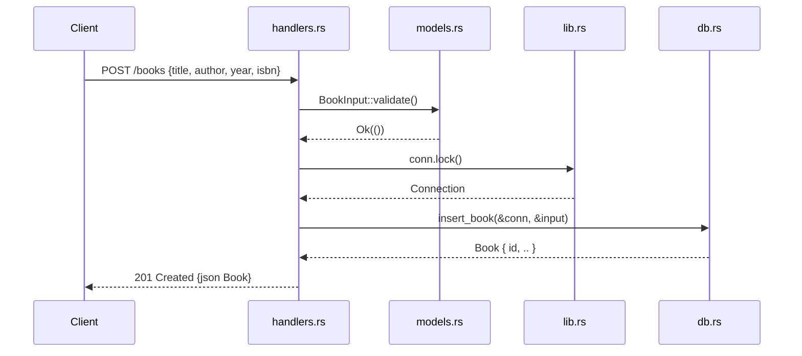

# Flow

A `POST /books` request deserializes into `BookInput` (all fields `#[serde(default)]`, so missing fields are tolerated), then `validate()` rejects empty `title`/`author` with a `400`. On success the handler takes the single `Arc<Mutex<Connection>>` lock, calls `db::insert_book` which executes an `INSERT` and reads `last_insert_rowid()`, and returns the created `Book` as `201`. All DB access is serialized through one mutex-guarded connection, so there is no connection pool and requests contend on a single lock. Errors from SQLite surface as `500` with the error string in the body.
