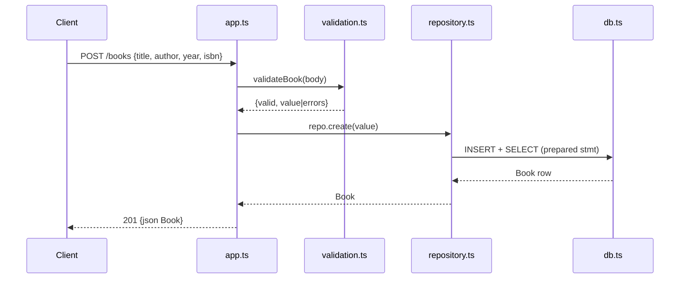

# Flow

A `POST /books` request is parsed by `express.json()`, then `validateBook()` normalises the body and rejects it with `400 {errors}` if `title` or `author` is missing/blank. On success, `BookRepository.create()` runs a prepared `INSERT` against the SQLite DB and re-selects the row by `lastInsertRowid`, returning the persisted `Book` as `201`. Reads/updates/deletes follow the same app → repository → prepared-statement path; id-bearing routes reject non-positive-integer ids with `400` and missing rows with `404`. DB access is synchronous (`node:sqlite` `DatabaseSync`); the DB is injected into `createApp`, so tests use an in-memory instance.
