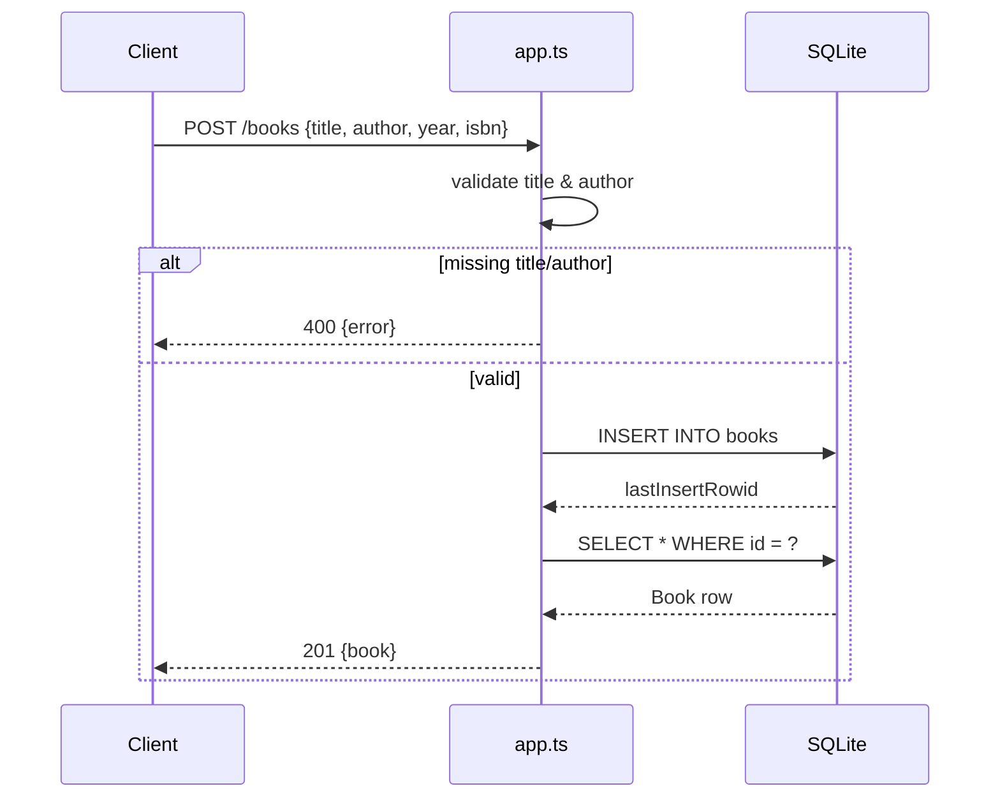

# Flow

A `POST /books` request is parsed by `express.json()`, then validated inline (`title` and `author` must be truthy) — a missing field returns `400` before any DB write. On success the handler runs a prepared `INSERT` via `better-sqlite3`, re-selects the inserted row by `lastInsertRowid`, and returns it with `201`. All handlers are synchronous (better-sqlite3 is synchronous by design). The DB connection is dependency-injected through `buildApp(db)`, so tests use an in-memory database while `server.ts` uses a file-backed `books.db`. Validation covers create and update; the `?author=` filter uses an exact-match `WHERE author = ?` (no partial/case-insensitive matching).
