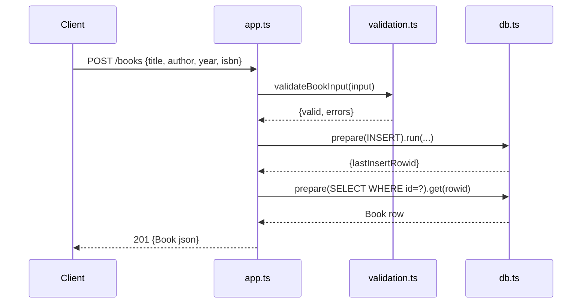

# Flow

A `POST /books` request is parsed by `express.json()`, validated by `validateBookInput` (title and author must be non-empty strings; year must be an integer and isbn a string when present). On validation failure the handler returns `400 {errors}`. On success it runs a parameterized `INSERT`, re-selects the inserted row by `lastInsertRowid`, and returns the persisted book with `201`. All routes use parameterized SQL prepared statements (no string interpolation), and the app factory takes the DB as an argument so tests inject an in-memory `:memory:` database. Synchronous `node:sqlite` calls run inside synchronous Express handlers — appropriate for this scale, no async DB layer.
