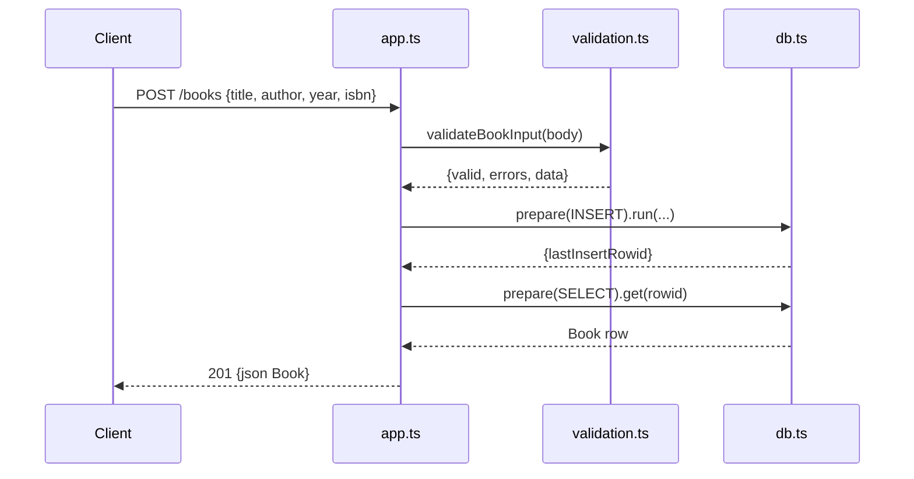

# Flow

A `POST /books` request is parsed by `express.json()`, validated by `validateBookInput` (rejecting with `400 {errors}` if title/author are missing or fields are mistyped), inserted via a prepared statement against the synchronous `node:sqlite` DB, then re-selected by `lastInsertRowid` and returned as `201 {json}`. All routes use parameterized prepared statements (no SQL injection surface). `PUT` merges partial input over the existing row; numeric `id` params are integer-checked before lookup, returning `400` on non-integer and `404` on absent rows. DB access is synchronous within the Express handlers.
