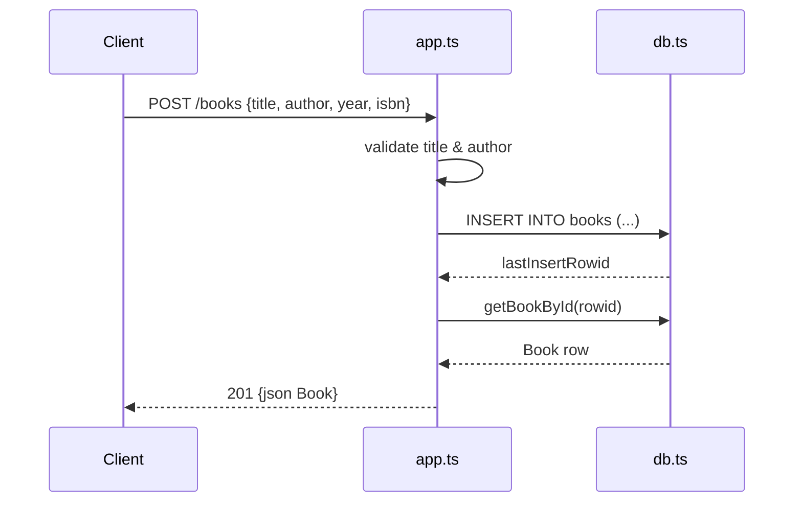

# Flow

A `POST /books` request validates that `title` and `author` are present (else `400`), inserts the row via a prepared `node:sqlite` statement, then re-selects the freshly inserted row through the shared `getBookById` helper and returns it as `201` JSON. Validation is presence-only (no type/length checks); `year`/`isbn` default to `null`. Author filtering on `GET /books` is exact-match. All DB access is synchronous (`DatabaseSync`).
