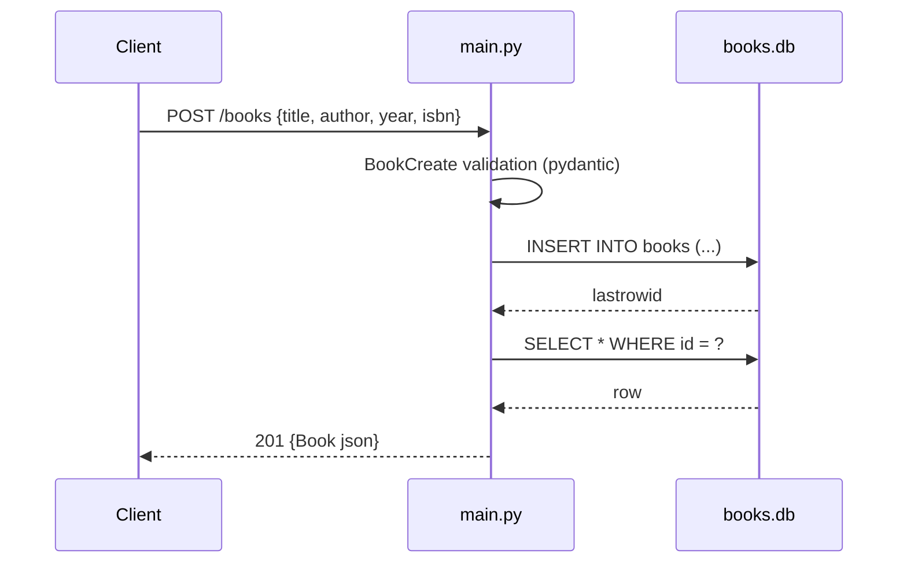

# Flow

A `POST /books` request is validated by the `BookCreate` pydantic model (missing `title`/`author` → 422), inserted into the SQLite `books` table via a parameterized query, then re-read by id and returned as JSON with a 201 status. Each handler opens and closes its own `sqlite3` connection per request. Note: the handler also contains an explicit empty-string guard raising 400, but pydantic's required-field check fires first for missing fields (so the 400 path is only reachable for empty strings). DB access is synchronous inside `async` handlers.
