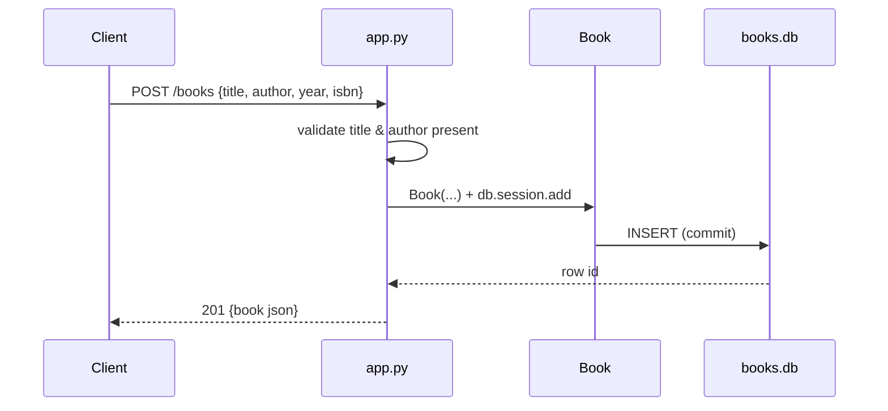

# Flow

A `POST /books` request is validated for the required `title` and `author` fields (400 if
either is missing), a `Book` row is constructed with optional `year`/`isbn`, committed to the
SQLite database, and the serialized book is returned with 201. Write handlers wrap the commit
in a broad `try/except Exception` that rolls back and returns 500 on failure. Read-by-id, update,
and delete routes use Flask-SQLAlchemy's `get_or_404`, giving automatic 404s for missing ids.
Update validates only that a body is present — it does not re-check that `title`/`author` stay
non-empty.
