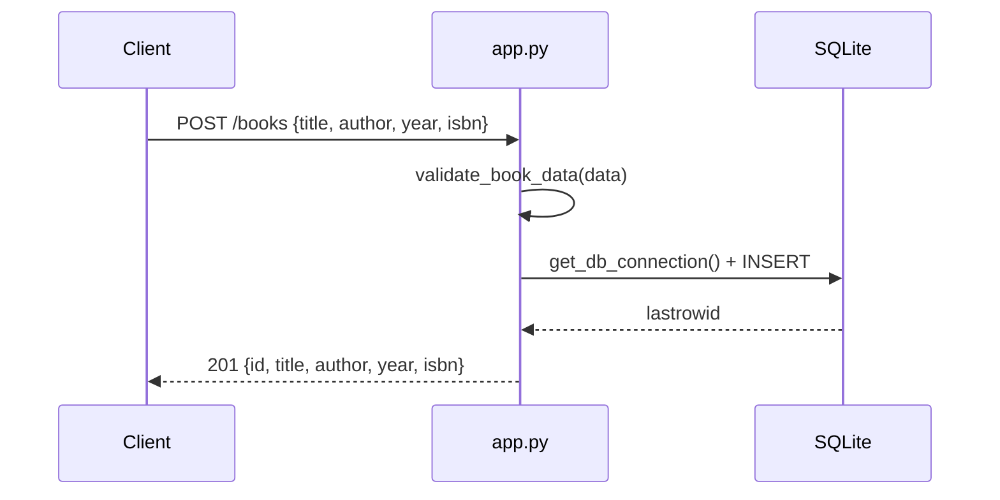

# Flow

A `POST /books` request is parsed with `request.get_json()`, validated by
`validate_book_data()` (title and author required, else 400), then a fresh
`sqlite3` connection inserts the row and returns the created book with its new
id as 201 JSON. A per-request connection is opened and closed for every handler
(no connection pooling). ISBN uniqueness is enforced at the DB level and mapped
to a 400. Notable: the Flask dev server is launched with `debug=True` bound to
`0.0.0.0`; `request.get_json()` is not guarded against a missing/invalid body
(a bodyless POST would raise before validation and hit the generic 500 handler).
