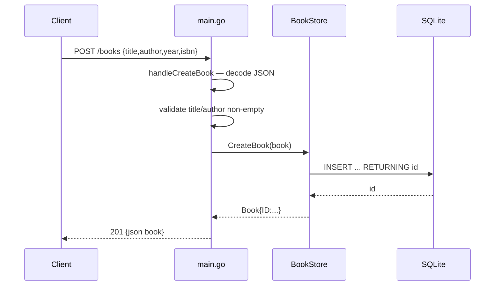

# Flow

A `POST /books` request is dispatched by the `/books` method-switch closure to `handleCreateBook`, which JSON-decodes the body, rejects empty `title` or `author` with 400, then calls `BookStore.CreateBook` (a parameterized `INSERT ... RETURNING id`) and returns the persisted book as 201 JSON.

Deviations from common patterns:
- Routing is hand-rolled with `strings.Split(path, "/")` and per-handler method switches rather than a router/mux; ID extraction is duplicated across handlers.
- `UpdateBook`/`DeleteBook` use `db.Exec` and check `err == sql.ErrNoRows`, but `Exec` never returns that error, so missing-ID updates/deletes return 200 instead of 404.
- The production `/books/{id}` handlers (`handle*WithID`) differ from the handlers the tests call (`handleGetBook`/`handleUpdateBook`/`handleDeleteBook`), so the wired request path is not what the tests exercise.
