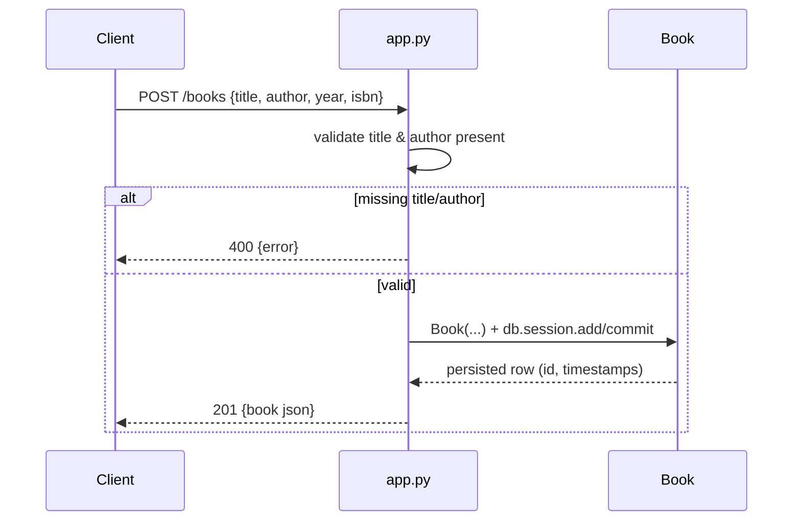

# Flow

A request to `POST /books` parses JSON, rejects the payload with 400 if `title`
or `author` is missing (`app.py:53`), otherwise constructs a `Book`, commits it
to the SQLite-backed session, and returns the serialized row with 201. Write
failures are caught and rolled back to a 500. The same file-based `books.db` is
shared by the app and by `tests.py`'s `setUp`/`tearDown`, which call
`db.create_all()`/`db.drop_all()` against the real database rather than an
isolated in-memory one.
