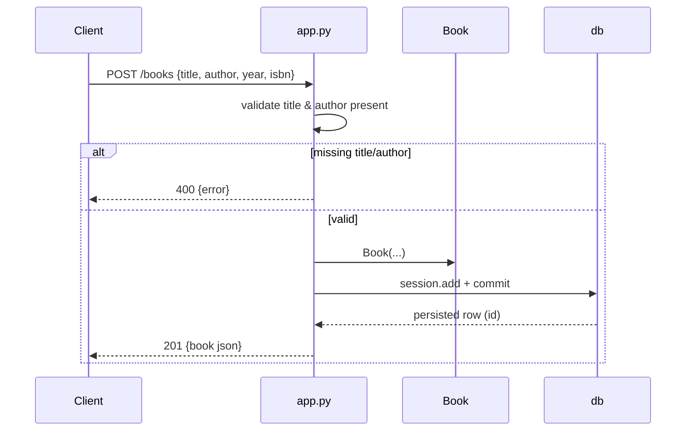

# Flow

A `POST /books` request is parsed via `request.get_json()`, then validated:
`title` and `author` must be truthy or the handler returns `400`. On success a
`Book` is instantiated, added to the SQLAlchemy session and committed to the
SQLite file `books.db`, and the serialized book is returned with `201`. Any
commit exception is caught, rolled back, and returned as a generic `500`.

Notable deviations: `year` is declared `nullable=False` on the model but is not
validated in the handler, so a POST omitting `year` fails at commit time with a
generic `500` rather than a `400`. The server runs with `debug=True` bound to
`0.0.0.0`. Tests share the same `books.db` configured on the app rather than an
isolated in-memory database.
