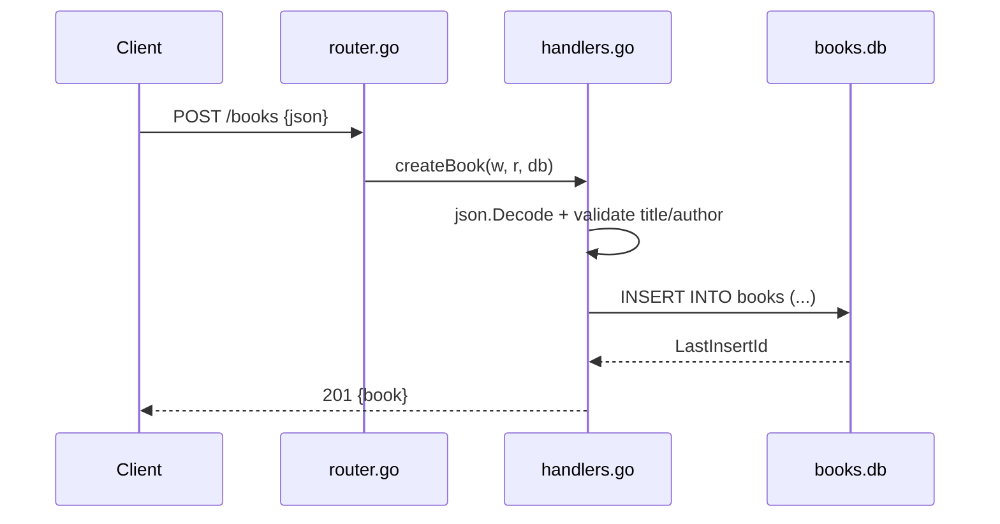

# Flow

A `POST /books` request is routed by gorilla/mux to `createBook`, which decodes
the JSON body into a `Book`, rejects it with `400` if `title` or `author` is
empty, then `INSERT`s the row into the shared SQLite file `./books.db` and
returns the created book with its new ID as `201`. DB access is synchronous and
per-request; there is no connection pooling config, no request timeout, and no
transaction wrapping.

Notable deviations from common patterns:
- **Shared on-disk DB across test runs:** tests open the same `./books.db` file
  and never reset it, so state accumulates between runs (see evaluation
  findings).
- **Update does not 404:** `PUT /books/{id}` on a non-existent id runs the
  `UPDATE` (0 rows affected) then re-`SELECT`s, returning `500` on
  `sql.ErrNoRows` rather than `404`.
- No pagination on `GET /books`.
