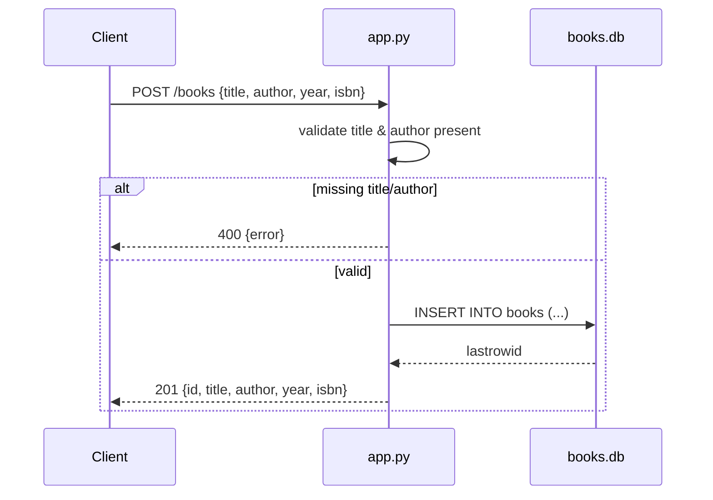

# Flow

A request to `POST /books` reads the JSON body, rejects it with `400` if `title` or
`author` is falsy, otherwise opens a fresh `sqlite3` connection via
`get_db_connection()`, inserts the row, and returns the created book with its new id
and `201`. Each handler opens and closes its own connection (no pooling). The
`?author=` filter on `GET /books` uses a `LIKE '%author%'` substring match rather than
an exact match. `debug=True` is set on `app.run`.
