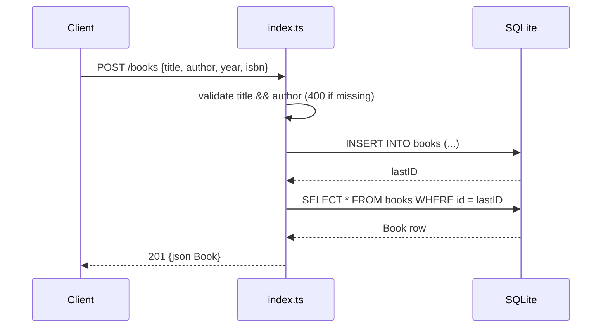

# Flow

A `POST /books` in `src/index.ts` validates that `title` and `author` are present (400 otherwise), inserts a row into the `books` SQLite table, re-reads it by `lastID`, and returns it as JSON 201. Error paths return 500.

Deviations from a runnable project:
- `index.ts` imports the `sqlite` package, which is **not** in `package.json` dependencies (only `sqlite3` is) — the module would fail to build/run as shipped.
- `index.ts` exports nothing and is never successfully imported by any test.
- `server.ts` (the only file with a default `app` export) imports `./database` and `./routes/books`, which do not exist — it cannot compile.
- The acceptance test `book.api.test.ts` imports `./src/index` from `src/__tests__/`, resolving to the non-existent `src/__tests__/src/index` — the suite never loads.
