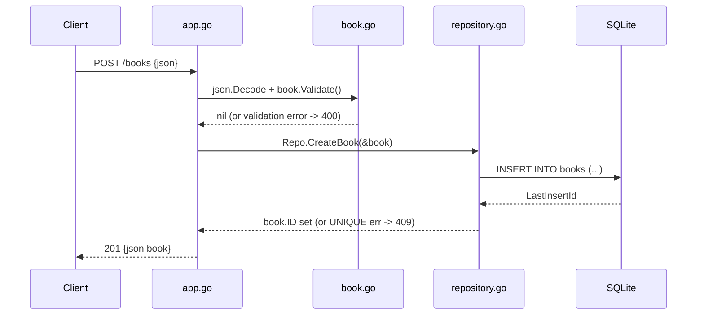

# Flow

A `POST /books` request is routed by `net/http` to `handleBooks`, which dispatches on method to `createBook`. The body is JSON-decoded into a `Book`; on decode failure it returns `400 Invalid JSON`. `book.Validate()` enforces non-empty title and author, returning `400` with a JSON `error` field otherwise. On success the repository executes a parameterized `INSERT` against SQLite and sets the generated ID. A duplicate ISBN surfaces as a driver error whose text contains `UNIQUE`, which the handler maps to `409 Conflict`; any other repo error becomes `500`. The created book (with ID) is echoed back as `201 Created`.

Deviations from common patterns: SQLite access is synchronous with no connection pooling config; `{id}` routing is manual string prefix trimming rather than a router library; error classification for conflicts relies on substring-matching the driver error text (`strings.Contains(err.Error(), "UNIQUE")`); `getBook` distinguishes "no rows" vs other errors by comparing error strings.
