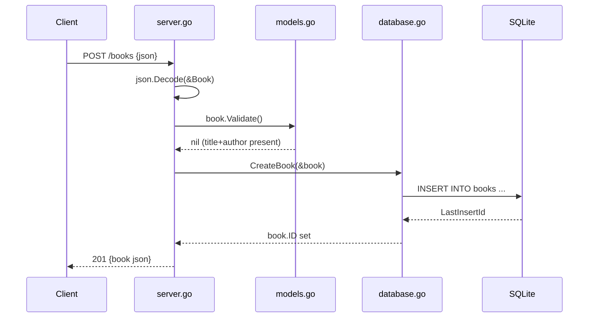

# Flow

A `POST /books` request is decoded into a `Book`, validated (title and author
required — otherwise `400`), then inserted into the SQLite `books` table via
`database.go:CreateBook`, which back-fills the generated `ID`. The created book
is returned as JSON with `201 Created`. Error handling is consistent across
routes: decode failures and validation failures return `400`, missing rows
return `404`, and DB errors return `500`. `PUT` and `DELETE` explicitly
`GetBook` first to distinguish `404` from a successful mutation.
