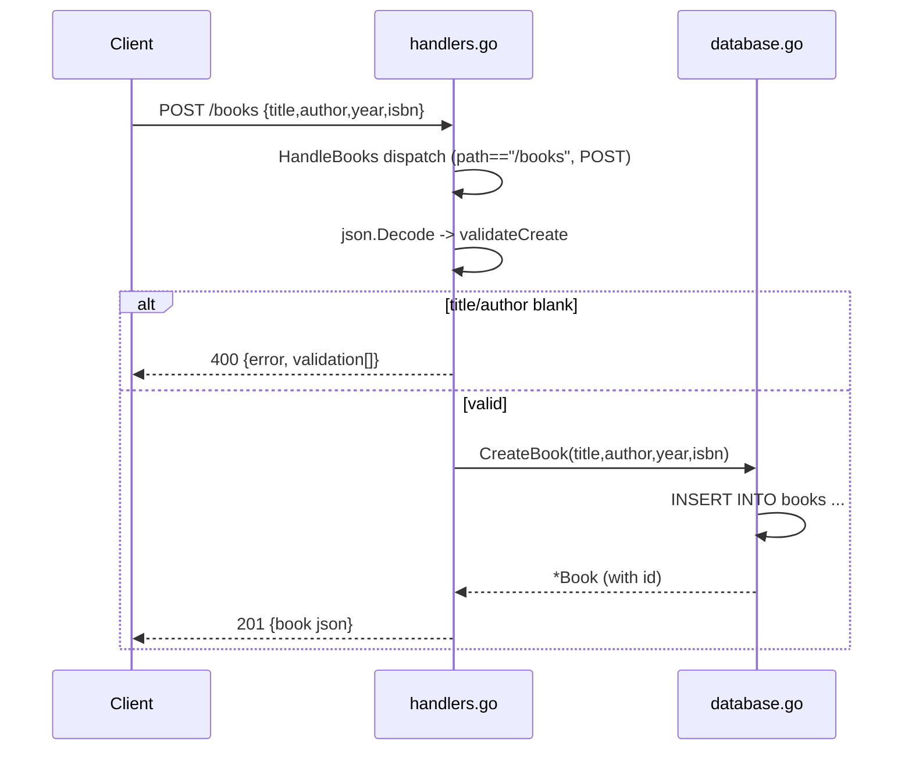

# Flow

A `POST /books` enters `HandleBooks`, which matches the exact `/books` path and
POST method and delegates to `HandleCreateBook`. The body is JSON-decoded into
`CreateBookRequest`; `validateCreate` rejects blank `title`/`author` with a 400
carrying per-field validation errors. On success `database.go:CreateBook` inserts
the row and returns the persisted `Book`, which is emitted as 201 JSON.

Notable deviations from common patterns:
- Routing is hand-rolled (no router library); `{id}` is parsed via string prefix
  trimming + `strconv.Atoi`.
- Create-time validation is enforced, but `UpdateBook` (PUT) applies no validation —
  a partial update can blank a required field.
- `?author=` uses a SQL `LIKE '%...%'` substring match rather than exact equality.
- Health timestamp is a Unix-epoch string rather than RFC3339.
