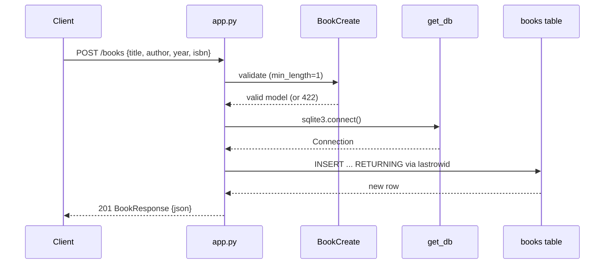

# Flow

A `POST /books` request is validated by the `BookCreate` Pydantic model (title and author require `min_length=1`, else FastAPI returns 422). A fresh SQLite connection is opened per request via `get_db()` (WAL mode), the row is inserted with `created_at`/`updated_at` timestamps, re-selected by `lastrowid`, and returned as a `BookResponse` with status 201. Each handler opens and closes its own connection in a `try/finally`; there is no shared connection pool or ORM. Validation rejects empty/missing title or author with 422 (FastAPI's default validation code) rather than 400.
